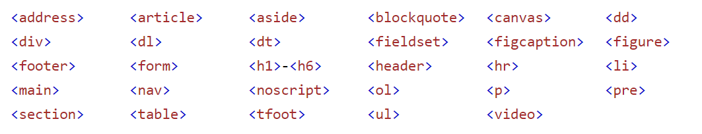
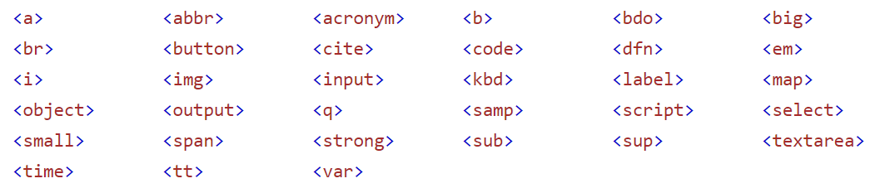

## [筆記]CSS Element Position 篇重點整理 - Part03 

#### Flow of Html

定義 : 瀏覽器線染 Html 的方式是從左到右，再從上到下，稱為 Flow of Html，有些 css 能改變 flow of html，進而讓 element 呈現的位置產稱變化。

----

#### [Block-level and Inline-level](https://stackblitz.com/edit/display-element-features?file=src%2Fapp%2Fapp.component.html) :link:

每個 html element 都有預設的 `display` 屬性，用來決定 elemtent 的顯示樣式，預設的 display 值通常為 block 和inline 兩種，預設為 block 屬性的 element 也被稱為 block-level element，以此類推，預設為 inline 的 element 被稱為 inline-level element，以下敘述兩者差別。

Block-level : 

* 瀏覽器呈現時，都會在新的一行被呈現。
* 在預設的情況下，所佔的長度為全寬。
* 本身自帶 top、bottom margin值，inline-level 沒有。



Inline-level : 

* 瀏覽器呈現時，不會在新的一行被呈現。
* **所佔的長度為自身所需的長度，無法設定寬高 ( width、height )**。



簡單來說，block 屬性的 element 像  `<div>`、`<h1>-<h6>`、`<table>` 等，在瀏覽器呈現的時候，會自己佔據一行，左右兩邊不會有其他 element，而且因為自帶 top、bottom margin 值，所以對上下 element 有一定距離。

而 Inline 屬性的 element 像 `<a>`、`<button>`、`` 等，在瀏覽器呈現的時候，會與其他 element 並排，而且無法改變長寬。

另外可以藉由改變 `display` 屬性，改變 element 預設屬性。

----

#### [inline-block](https://stackblitz.com/edit/display-element-features?file=src%2Fapp%2Fapp.component.html) :link:

呈上 `display` 屬性除了預設的 block 、inline ，還有 inline-block，inline-block 結合了 inline 可以並排的特性，和 block 可以改變長寬的特性，讓 element 可以設定自訂的長寬，也不會被自動站一行 (注意 : 如果設定的寬度大於瀏覽器的全寬，還是會換行的喔 !!)。

```css
.position {
    /* block、inline 為預設，看 element tag */
    display: block | inline | inline-block;
}
```

----

#### [Position](https://stackblitz.com/edit/angular-ivy-m9tymk) :link:

* static : 為 position 預設值，不需要特別設定。
* relative :  依原始位置，設定 "新位置" 位移屬性( top、bottom、left、right )的值。
* absolute : 依最接近 "position 不為 static" 的父元素位置，設定 "新位置" 位移屬性( top、bottom、left、right )的值，都沒有父元素通常以 `<body>` 為依據。
* fixed : 依視窗位置，設定 "新位置" 位移屬性( top、bottom、left、right )的值，因為是依視窗位置決定位置，所以頁面在滑動時會產生固定的效果。 

呈上當一個頁面同時有很多個 element 有設定 position 屬性時，可能會發生重疊的問題，而 `z-index` 屬性可以設定 element 覆蓋的先後順序。

* z-index : 預設值為 auto，整數設定( 範圍 : ±2147483647)，數字越大顯示在越上面。

注意 : z-index 只對於有設定 position 的 element 才有效( static 不算喔)，另外 z-index 只在同級  element 間競爭。

----

#### Float and Claer

除了用 position 屬性調整 element 位置外，如果想要快速調整 element 的左右位置，可以使用 `float` 屬性。

當想要清除 element 附近其他 float 元素時，可以用 `clear` 屬性。

```css
.position {
    /* 讓 elemnt 的位置移到最左邊或最右邊 */
    float: left | right; 
    /* 清除 element 左邊、右邊、兩側的 flaot element，預設為 none 不清除*/
    clear: left | right | both | none;
}
```

----

#### 常用 CSS Position

```css
.position {
    
    position: static | relative | absolute | fixed;
    /* 搭配 position 使用，決定 element 的前後順序，數字越大越前面 */
    z-index: ±2147483647;
    
    /* block、inline 為預設，看 element tag */
    display: block | inline | inline-block;
    
    /* 讓 elemnt 的位置移到最左邊或最右邊 */
    float: left | right;
    /* 清除 element 左邊、右邊、兩側的 flaot element，預設為 none 不清除*/
    clear: left | right | both | none;
   
}
```

